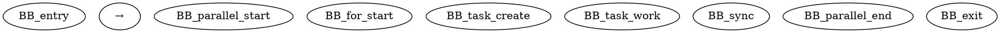
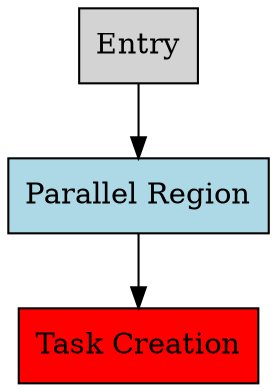

# LLM-Based CFG Generation Pipeline: Complete Technical Explanation

## 🔍 Pipeline Overview

The pipeline transforms OpenMP C code into Control Flow Graphs through a multi-stage process:

```
Input C Code → OpenMP Analysis → LLM Prompt → CFG Generation → Validation → Output
```

## 🏗️ Architecture Components

### 1. **OpenMP Construct Detector**
**File**: `scripts/cfg_generator.py` (lines 15-80)
**Purpose**: Analyzes source code to identify OpenMP pragmas

```python
def extract_openmp_constructs(self, source_code: str) -> Dict:
    # Scans each line for #pragma omp directives
    # Categorizes into: parallel_regions, tasks, for_loops, single_regions, sync_points
    # Extracts attributes: untied/tied, firstprivate, shared, nowait, etc.
```

**What it detects:**
- `#pragma omp parallel` → Parallel regions
- `#pragma omp task` → Task creation points
- `#pragma omp for` → Parallel loops
- `#pragma omp single` → Single execution regions
- `#pragma omp barrier/taskwait` → Synchronization points

### 2. **LLM Prompt Generator**
**File**: `scripts/cfg_generator.py` (lines 82-120)
**Purpose**: Creates structured prompts for LLM understanding

```python
def generate_cfg_prompt(self, source_code: str, hardware_specs: Dict) -> str:
    # Combines: detected constructs + source code + hardware specs
    # Creates detailed prompt with requirements and output format
```

**Prompt Structure:**
```
DETECTED OPENMP CONSTRUCTS: {JSON of found pragmas}
SOURCE CODE: {Complete C code}
HARDWARE SPECIFICATIONS: {cores, arch, memory}
REQUIREMENTS: {CFG generation rules}
OUTPUT FORMAT: {DOT notation specifications}
```

### 3. **CFG Generation Engine**
**File**: `scripts/cfg_generator.py` (lines 122-280)
**Purpose**: Generates CFGs based on detected patterns

```python
def simulate_llm_response(self, source_code: str, constructs: Dict) -> str:
    # Pattern matching: SparseLU, task-parallel, parallel-for, basic
    # Calls specialized generators for each pattern
```

**Pattern Recognition:**
- **SparseLU Pattern**: Nested loops + tasks + single regions
- **Task-Parallel Pattern**: Parallel regions + task creation
- **Parallel-For Pattern**: Parallel regions + for loops
- **Basic Pattern**: Sequential or simple parallel code

### 4. **CFG Templates**
**Purpose**: Pre-defined graph structures for common OpenMP patterns

#### SparseLU Template:
```dot
digraph "SparseLU_CFG" {
    BB_entry → BB_parallel_start → BB_k_loop → BB_single_lu0
    BB_single_lu0 → BB_for1_start → BB_fwd_task
    BB_fwd_task → BB_for2_start → BB_bdiv_task
    BB_bdiv_task → BB_for3_start → BB_bmod_task
    BB_bmod_task → BB_k_continue → BB_k_loop (loop back)
    BB_k_loop → BB_parallel_end → BB_exit (exit condition)
}
```

#### Task-Parallel Template:


### 5. **Validation Engine**
**File**: `scripts/cfg_generator.py` (lines 282-310)
**Purpose**: Ensures CFG quality and correctness

```python
def validate_cfg(self, dot_graph: str, original_code: str) -> Dict:
    # Checks: entry/exit points, parallel regions, tasks, sync points
    # Validates: DOT syntax, edge connectivity
```

**Validation Checks:**
- ✅ **Entry/Exit Points**: Graph has proper boundaries
- ✅ **Parallel Regions**: Detected constructs are represented
- ✅ **Task Constructs**: Task creation points are marked
- ✅ **Synchronization**: Barriers and sync points are included
- ✅ **DOT Syntax**: Valid Graphviz format
- ✅ **Edge Connectivity**: Control flow edges exist

### 6. **Output Generator**
**File**: `scripts/cfg_generator.py` (lines 312-340)
**Purpose**: Saves CFGs in multiple formats

```python
def save_cfg(self, dot_graph: str, output_path: str, benchmark_name: str):
    # Saves DOT file (machine-readable)
    # Generates PNG visualization (human-readable)
    # Handles fallbacks for missing graphviz
```

## 🔄 Data Flow Walkthrough

### Step 1: Input Processing
```python
# Read source code
with open(args.input, 'r') as f:
    source_code = f.read()

# Example input: sparselu.c
```

### Step 2: OpenMP Analysis
```python
constructs = generator.extract_openmp_constructs(source_code)
# Output: JSON with detected pragmas and their properties
{
  "parallel_regions": [{"line": 254, "pragma": "#pragma omp parallel private(kk)"}],
  "tasks": [{"line": 264, "pragma": "#pragma omp task untied firstprivate(kk, jj)"}],
  "for_loops": [{"line": 261, "pragma": "#pragma omp for nowait"}],
  "single_regions": [{"line": 258, "pragma": "#pragma omp single"}]
}
```

### Step 3: Pattern Recognition
```python
# Analyze code characteristics
has_parallel = len(constructs['parallel_regions']) > 0
has_tasks = len(constructs['tasks']) > 0
has_for_loops = len(constructs['for_loops']) > 0

# Select appropriate template
if 'sparselu' in source_code.lower():
    return self._generate_sparselu_cfg()
elif has_parallel and has_tasks:
    return self._generate_task_parallel_cfg()
```

### Step 4: CFG Generation
```python
# Generate DOT graph based on pattern
cfg_dot = generator.simulate_llm_response(source_code, constructs)
# Output: Complete DOT notation graph
```

### Step 5: Validation
```python
validation = generator.validate_cfg(cfg_dot, source_code)
# Output: Dictionary of validation results
{
  "has_entry_exit": True,
  "parallel_regions_detected": True,
  "tasks_detected": True,
  "valid_dot_syntax": True
}
```

### Step 6: Output Generation
```python
# Save DOT file
dot_file = os.path.join(output_path, f"{benchmark_name}_cfg.dot")

# Generate PNG visualization
subprocess.run(['dot', '-Tpng', dot_file, '-o', png_file])
```

## 🎯 Running Different Benchmarks

### 1. **Single Benchmark Processing**

```bash
# SparseLU (matrix factorization)
python cfg_generator.py --input ../bots/omp-tasks/sparselu/sparselu_for/sparselu.c

# FFT (Fast Fourier Transform)
python cfg_generator.py --input ../bots/omp-tasks/fft/fft.c

# N-Queens (backtracking algorithm)
python cfg_generator.py --input ../bots/omp-tasks/nqueens/nqueens.c

# Strassen (matrix multiplication)
python cfg_generator.py --input ../bots/omp-tasks/strassen/strassen.c

# Health (discrete event simulation)
python cfg_generator.py --input ../bots/omp-tasks/health/health.c
```

### 2. **Custom Hardware Specifications**

```bash
# High-performance server
python cfg_generator.py --input benchmark.c --cores 32 --arch x86_64

# Embedded system
python cfg_generator.py --input benchmark.c --cores 4 --arch arm64

# Workstation
python cfg_generator.py --input benchmark.c --cores 16 --arch x86_64
```

### 3. **Batch Processing All BOTS**

```bash
# Process all 14 BOTS benchmarks
python batch_process.py

# Output: 14 DOT files + 14 PNG files in ../output/
```

### 4. **Your Own OpenMP Code**

```bash
# Any OpenMP C file
python cfg_generator.py --input /path/to/your/openmp_code.c --output /path/to/results/
```

## 🔧 Customization Options

### 1. **Adding New CFG Patterns**

Edit `scripts/cfg_generator.py`:

```python
def _generate_custom_pattern_cfg(self) -> str:
    """Generate CFG for your specific pattern"""
    return '''
digraph "Custom_CFG" {
    rankdir=TB;
    node [shape=box, style=filled];
    
    BB_entry [label="Entry", fillcolor=lightgray];
    BB_custom [label="Your Pattern", fillcolor=lightblue];
    BB_exit [label="Exit", fillcolor=lightgray];
    
    BB_entry -> BB_custom;
    BB_custom -> BB_exit;
}
'''

# Add to pattern recognition:
elif 'your_pattern' in source_code.lower():
    return self._generate_custom_pattern_cfg()
```

### 2. **Modifying Hardware Configurations**

Edit `configs/hardware_specs.json`:

```json
{
    "your_system": {
        "cores": 24,
        "arch": "x86_64",
        "memory": "48GB",
        "cache_l1": "32KB",
        "cache_l2": "512KB",
        "cache_l3": "24MB"
    }
}
```

### 3. **Adding New OpenMP Constructs**

Edit the `extract_openmp_constructs` function:

```python
elif 'sections' in line_stripped:
    constructs['sections'].append({
        'line': i + 1,
        'pragma': line_stripped,
        'type': 'sections'
    })
```

### 4. **Custom Validation Rules**

Add to `validate_cfg` function:

```python
# Check for custom requirements
if 'your_requirement' in dot_graph:
    validation_results['custom_check'] = True
```

## 📊 Understanding the Output

### DOT File Structure


### Color Coding
- **Light Gray**: Entry/Exit points
- **Light Blue**: Parallel regions
- **Red**: Task creation
- **Yellow**: Parallel for loops
- **Light Green**: Synchronization points
- **White**: Sequential code

### Node Labels
- **BB_X**: Basic block identifier
- **Pragma info**: OpenMP directive details
- **Function calls**: Key operations (lu0, fwd, bdiv, bmod)

## 🚀 Advanced Usage

### 1. **Integration with Real LLMs**

Replace the simulation with actual API calls:

```python
def call_real_llm(self, prompt: str) -> str:
    import openai
    response = openai.ChatCompletion.create(
        model="gpt-4",
        messages=[{"role": "user", "content": prompt}],
        max_tokens=2000
    )
    return response.choices[0].message.content
```

### 2. **Performance Analysis Integration**

Add timing and performance metrics:

```python
def analyze_performance(self, cfg_dot: str, hardware_specs: Dict):
    # Estimate execution time based on CFG structure
    # Calculate parallelization efficiency
    # Predict bottlenecks
```

### 3. **Comparative Analysis**

Compare different OpenMP variants:

```bash
# Compare tied vs untied tasks
python cfg_generator.py --input sparselu_tied.c --output results/tied/
python cfg_generator.py --input sparselu_untied.c --output results/untied/
```

## 🎯 Research Applications

### 1. **Variant Comparison**
- Generate CFGs for different OpenMP implementations
- Compare control flow complexity
- Identify optimization opportunities

### 2. **Performance Prediction**
- Use CFG structure to predict execution patterns
- Estimate parallelization overhead
- Guide hardware-specific optimizations

### 3. **Code Understanding**
- Visualize complex parallel algorithms
- Document OpenMP design patterns
- Support code reviews and education

This pipeline provides a solid foundation for Mohammad's research while being flexible enough to extend for new requirements and benchmarks!

